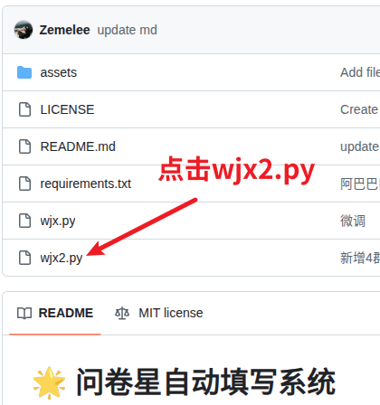
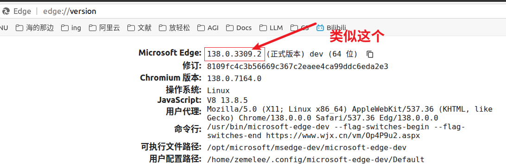

# 🌟 问卷星自动填写系统

> 同学们，给个免费的 Star 行吗？✨  
> 求Star不给也没办法，毕竟我拿你们没办法.jpg


## 🧾 项目简介  

本项目名叫《问卷数据模拟系统》，基于 **Selenium** 实现自动化填写问卷功能。  
虽然代码可能有点乱，但人和代码有一个能跑就行对吧？

- ✅ **IP 切换**：通过代理服务器实现多 IP 填写，防止被封；
- ✅ **选项比例定制**：每道题目可自定义选择比例，假装自己是个真实用户；
- ✅ **多窗口并发**：支持多个浏览器窗口同时运行，填得快点不至于太无聊。

## 🛠️ 功能特色  

| 功能               | 描述                                                                 |
| ------------------ | -------------------------------------------------------------------- |
| 🌐 IP 切换          | 支持使用代理服务器切换 IP 地址，避免频繁提交导致 IP 被限制           |
| 📊 题目选项比例设置 | 每个问题可设定各选项的随机分布比例，假装你是个人类                   |
| 🖼️ 多窗口并发       | 多线程打开多个浏览器窗口并行填写问卷，提升效率（也提升电脑风扇转速） |

## 🚀 快速开始


### 第一步：获取代码文件
这是一个刷问卷的代码项目，项目里有多个文件，你现在正在阅读REAMDME.md文件，包括这行字，也是写在了REAMDME.md文件中。对于代码，你只需要关注`wjx2.py`文件，其他的无需关注。如下所示。



点击wjx2.py会跳转到具体的代码页面，复制全部代码内容， 在本地创建新文件 `wjx2.py`，粘贴保存。这样就算把代码保存下来了。


### 第二步：安装必要环境

运行起来还需要安装环境，你可以使用以下命令配置环境。打开命令行/终端，依次执行以下命令：

```bash
pip3 install requests -i https://pypi.tuna.tsinghua.edu.cn/simple # 用于网络请求
pip3 install numpy -i https://pypi.tuna.tsinghua.edu.cn/simple # 用于比例计算
pip3 install selenium -i https://pypi.tuna.tsinghua.edu.cn/simple # 浏览器自动化核心
```

### 第三步：安装 ChromeDriver 浏览器驱动

打开Chrome浏览器，地址栏输入 `chrome://version` 并回车，记录第一行显示的版本号（例如：138.0.3309.2）,如下所示。


按照[视频教程3分53秒](https://www.bilibili.com/video/BV1SL411o7ym?t=232.8)描述的那样，安装`ChromeDriver`，不过视频中的链接已过时，`ChromeDriver`可以在[ChromeDriver链接](https://googlechromelabs.github.io/chrome-for-testing/)处下载，但是环境配置方法并未过时。

所有步骤配置完成后，环境就装配好了，运行`python wjx2.py`即可开始填写问卷。

---
需要说明的是，如果你对上述说明存在理解困难，你需要寻求会一点技术的同学来帮忙，此工具不适合完全没有编程经验的用户使用。

或者你也可以使用🔗[在线问卷自动化平台](http://sugarblack.top)😊。

### 第四步：运行程序

执行主文件开始填写问卷：

```bash
python wjx2.py
```

## ⚙️ 配置文件说明  

🔧 配置文件持续更新中...  
（意思是有些地方你自己看着改吧，注释应该够用了）

你可以根据需要修改题目选项的比例、代理地址等参数，详细配置请参考项目中的注释说明。

不想看代码？那你也可以试试这个网站：
🔗 [速填通 - 注册送额度](http://sugarblack.top)  
图形界面操作，适合不想折腾的朋友。


## 📈 数据分析&模拟数据服务

问卷填写搞定了，但后续的数据分析或没有真实数据怎么办？笔者提供**从零开始的模拟数据生成服务**，并录入在线问卷平台，直接交付符合科研标准的结果！

| 分析类型       | 核心指标                   |
| -------------- | -------------------------- |
| 信度检验       | α>0.8 ✅                    |
| 效度检验       | KMO>0.8、Bartlett p<0.05 ✅ |
| 相关性分析     | r=0.3~0.7、p<0.05 ✅        |
| 线性回归       | R²>0.6 ✅                   |
| 二元逻辑回归   | AUC>0.8 ✅                  |
| 独立/配对T检验 | p<0.05 ✅                   |
| ANOVA方差分析  | p<0.05 ✅                   |
| 中介/调节效应  | 交互项显著 ✅               |
| ...            | ... ✅                      |

支持数据录入问卷星，附分析指标报告，全程匹配你的研究假设！  
需求咨询：加入下方QQ群 → 私聊管理员，或者[进入链接](http://sugarblack.top/#/home/about)点击"联系管理 --> 微信"即可。


## 💬 加入交流群  

有问题欢迎加入我们的 QQ 群进行交流👇

👥 QQ 交流群（越早人可能越满）：

| 序号 | 群号      |
| ---- | --------- |
| 群4  | 931614446 |
| 群3  | 850281779 |
| 群2  | 427847187 |
| 群1  | 774326264 |

💡 注：群里热心网友会帮助你（如果他们知道的话）。  
当然，提问前请先看看群公告，别问“怎么安装”这种基础问题，除非你真的不会。

## ❤️ 最后的话  

如果你觉得这个项目对你有帮助，请不要吝啬你的 **Star**！  
我写代码~~不是为了钱~~，就是为了虚荣心和成就感！


油猴的问卷星脚本：[脚本猫地址](https://scriptcat.org/zh-CN/script-show-page/2833) / [油叉网地址](https://greasyfork.org/zh-CN/scripts/466722-%E9%97%AE%E5%8D%B7%E6%98%9F%E8%84%9A%E6%9C%AC)

油猴的问卷网脚本：[ScriptCat链接](https://scriptcat.org/zh-CN/script-show-page/3471) / [油叉网地址](https://greasyfork.org/zh-CN/scripts/536949-q11e-wjw)

公众号：[做实验的研究牲](https://mp.weixin.qq.com/s/iluh6THakUs8ygbphwVJ1Q)

🎉 **感谢使用，祝你问卷轻松过百份，老板看了都感动！**

最后的最后，不想看代码？那你也可以试试这个网站：
🔗 [速填通 - 注册送额度](http://sugarblack.top)。图形界面操作，适合不想折腾的朋友。

最后的最后的最后，不想自己动手？进群咨询管理员，**从0开始完美模拟各种数据需求，一站式生成并录入问卷星系统，省心又省力！**
